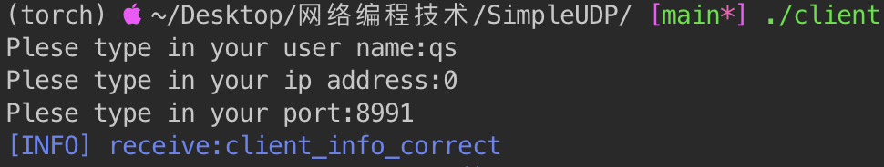
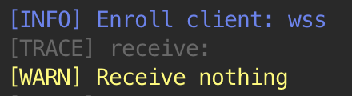
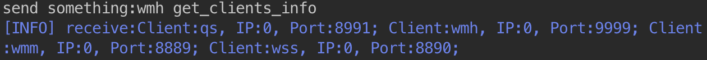
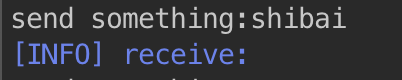

# SimpleUDP

## 协议设计

* 纯字符串流，单个信息大小不超过512Byte。

* 设计
    * 信息登记
        * Client信息登记：`client_info <用户名> <IP地址> <端口号>`
            * 用户名不含空格
            * IP地址格式为十进制数
            * 端口号为十进制数字
        * Server确认Client登记正确：`client_info_correct`
        * Server返回Client登记失败：`client_info_error`
    * 发送消息
        * Client发送消息：`<用户名> <消息>`
        * Server确认收到：`Send %d data success!`
    * 信息查询
        * Client信息查询：`<用户名> get_clients_info`
        * Server返回Client信息：`{<用户名>: }`
    * 其他

## 处理流程

### Server

1. 初始化
2. 监听ANY
3. 如果有新Client加入，记录信息。
    * 检查各字段格式，若正确则返回检查正确消息`client_info_correct`
4. 如果有询问请求，返回所有Client的信息。
5. 如果接受消息前缀有已注册用户，返回发送成功的消息。

### Client

1. 初始化
2. 提示输入本机用户名、IP、Port，完成后发向Server。
3. 若收到确认消息，则此时可以发送任意信息
4. 若发送`<用户名> get_clients_info`，Server应返回所有Client的信息。

## 测试效果

1. 启动server

2. 启动client并注册信息

3. 注册多个client

server输出注册成功log，并给client返回正确消息

3. 查询其他client的信息

4. 发送信息成功示例（前缀有已登记的用户名）

5. 发送失败示例（前缀没有已登记的用户名）

表现为Server没有返回信息

### 运行方法

编译：命令行输入make

运行程序：`./server` `./client`

